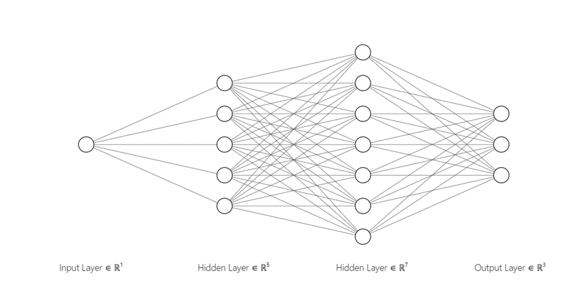
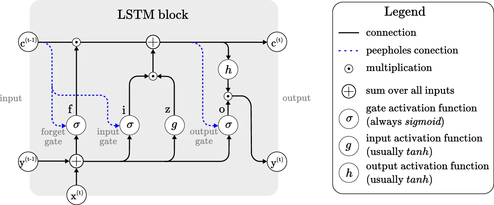
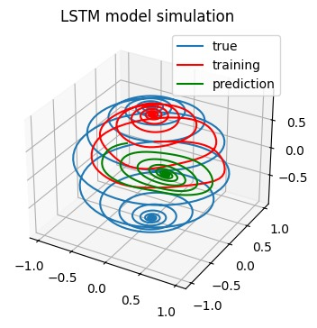
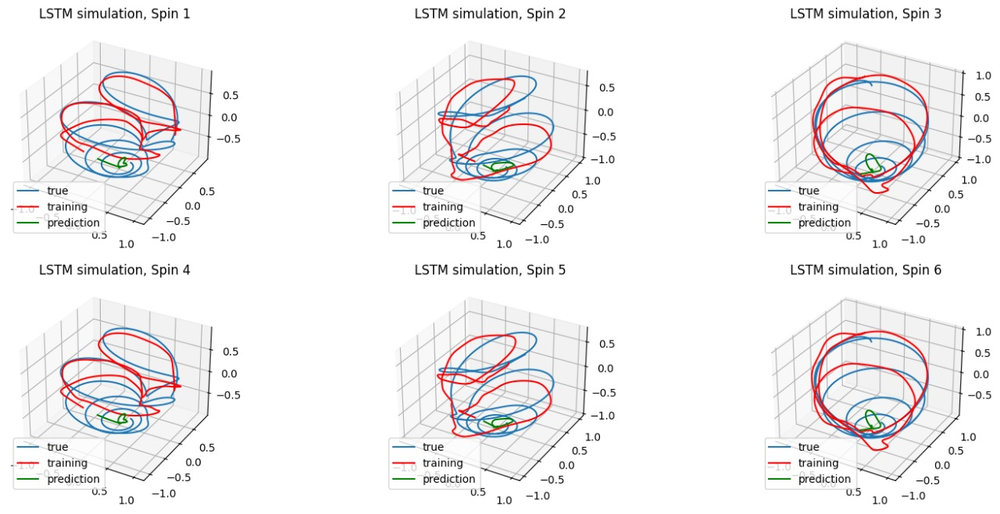
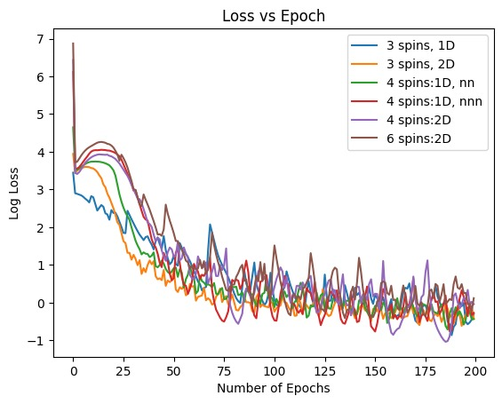

# Physics-Informed Neural Networks (PINNs) for High-Fidelity Landau-Lifshitz-Gilbert (LLG) Equation Simulation

## Project Overview

This repository contains the implementation of **Physics-Informed Neural Networks (PINNs)** to simulate the **Landau-Lifshitz-Gilbert (LLG) equation**. The LLG equation describes the dynamics of magnetization in ferromagnetic materials and is widely used in spintronics and magnonics research.

## Overview

The project explores the use of PINNs to solve the LLG equation by incorporating physical laws into the loss function of a deep learning model. The neural network is trained to approximate magnetization dynamics while ensuring consistency with the governing PDE.

## Key Features

*   **Physics-Driven Loss Formulation:** A bespoke hybrid loss function meticulously designed to embed the LLG equation's dynamics. This loss comprises:
    *   **Data Loss (\(MSE_u\)):** Minimizes the Mean Squared Error between the neural network's output and observed magnetization time-series data.
    *   **Physics Residual Loss (\(Loss_{pde}\)):** Enforces the LLG equation as a hard constraint by penalizing deviations from its form, ensuring the model's predictions adhere to the fundamental physics.
    *   **Normalization Constraint (\(Loss_{norm}\)):** Guarantees the physical validity of the magnetization vector by maintaining its unit norm \( (||m|| = 1) \).
*   **Advanced Neural Network Architectures:** Implementation and comparative analysis of two distinct network types:
    *   **Multi-Layer Feed-Forward Neural Networks (MLFFNNs):** Explored for their ability to learn complex non-linear mappings.
    *   **Long Short-Term Memory (LSTM) Recurrent Neural Networks (RNNs):** Utilized for their exceptional capability in handling sequential data and capturing long-range temporal dependencies inherent in magnetization dynamics, especially crucial for multi-spin interactions where the output from one time step influences the next.
*   **Complex Multi-Spin System Simulations:** Demonstrated the PINNs' capacity to simulate the time evolution of magnetization for systems involving multiple interacting spins arranged in various geometries (linear chains, triangles, squares, hexagons), a significant step towards realistic material modeling.
*   **Hyperparameter Optimization:** Thorough investigation into the impact of critical parameters such as network depth (layers), width (neurons per layer), damping parameter (\(\alpha\)), training data size, and collocation point density on model accuracy and training efficiency.

### Visualizing the Architectures:

*Figure 3.1: Basic network architecture used for Multi-Layer Feed-Forward Neural Networks.*

*Figure 3.14: Internal workings of an LSTM block, illustrating its components for handling sequential data (from (6)).*

## Implementation Details

The project leverages PyTorch's automatic differentiation capabilities to compute the necessary derivatives for the physics residual loss. Models were trained on a high-performance GPU, utilizing the Adam optimizer for efficient learning.

## Results & Insights

The PINN models successfully learn and simulate magnetization dynamics, demonstrating their potential for complex physical systems. Notably, the **LSTM-based architectures showed superior performance** compared to standard feed-forward networks, particularly in capturing the intricate temporal dependencies and interactions within multi-spin configurations.

While PINNs offer remarkable flexibility for problems with non-trivial geometries and boundary conditions, the current implementations were found to be **computationally more intensive and, in some cases, less accurate than highly optimized traditional numerical ODE solvers** for the scales explored. This highlights an important trade-off: PINNs provide a powerful, generalized framework but may require significant computational resources and further optimization for direct competition with specialized solvers in specific, well-defined scenarios.

Future work aims to scale these models to even larger systems of interacting spins, exploring strategies to enhance their computational efficiency and accuracy to potentially surpass traditional methods.

### Simulation Examples & Performance:

**Isolated Spin Simulation using LSTM:**

*Figure 3.15: LSTM simulation for an Isolated Spin. The model (prediction) accurately tracks the true (ground truth) magnetization dynamics, demonstrating the network's foundational learning capability.*

**Magnetization Dynamics of 6 Interacting Spins in a Hexagonal Arrangement:**

*Figure 3.22: Simulation of magnetization for 6 spins arranged in a Hexagon, demonstrating the PINN's capacity to model complex interacting systems and predict their temporal evolution.*

**Training Performance: Loss Convergence for Various LSTM Models:**

*Figure 3.24: Log loss convergence during training for different LSTM models applied to various multi-spin configurations (e.g., 3 spins 1D, 6 spins 2D). This illustrates the training stability and performance across different problem complexities.*

## Technologies

*   **Python 3.10.13**
*   **PyTorch 2.1.1:** Essential for building dynamic computational graphs and neural network models.
*   **NumPy:** For efficient numerical operations and data manipulation.
*   **Matplotlib:** For data visualization and plotting results.